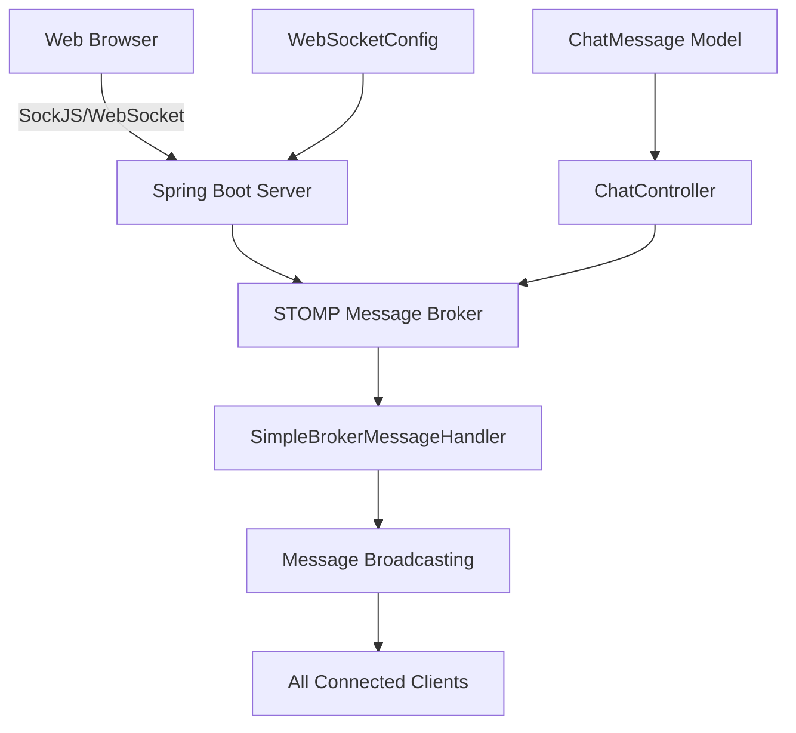
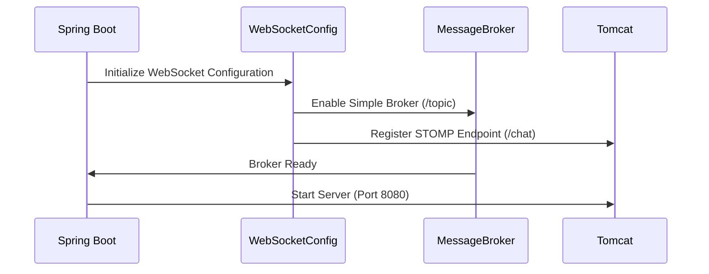
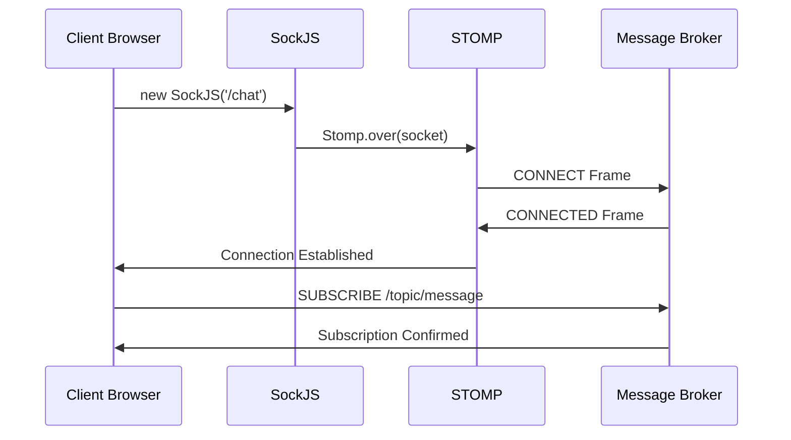
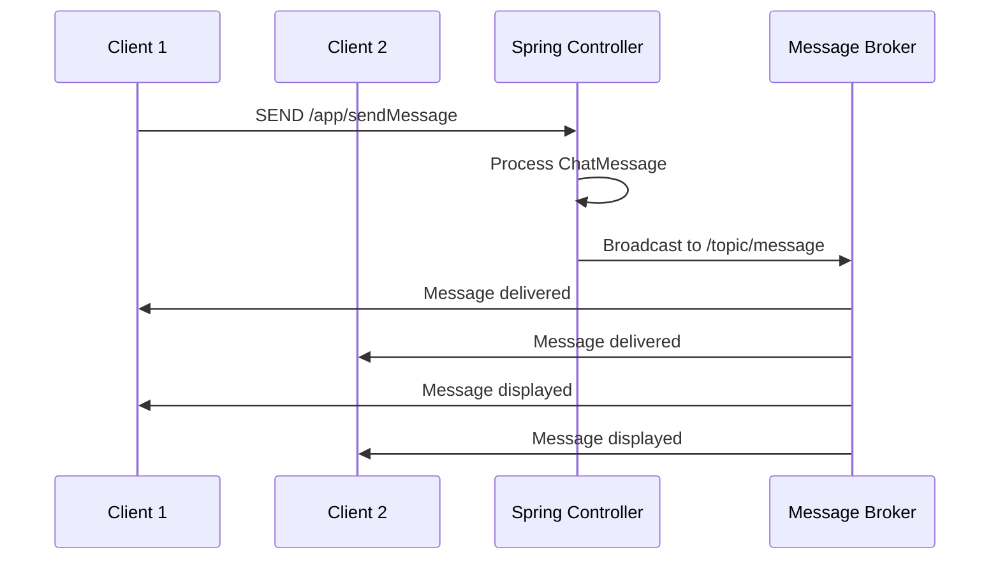

# 💬 STOMP Chat Application

A real-time chat application built with **Spring Boot**, **STOMP messaging**, and **WebSockets** with **SockJS** fallback support.

## 🏗️ **Architecture Overview**



## 🛠️ **Technology Stack**

| Component | Technology | Version |
|-----------|------------|---------|
| **Backend Framework** | Spring Boot | 3.5.3 |
| **Java Version** | OpenJDK | 21/23 |
| **Messaging Protocol** | STOMP | - |
| **WebSocket Library** | SockJS | 1.x |
| **Frontend Framework** | Vanilla JavaScript | - |
| **CSS Framework** | Bootstrap | 3.4.1 |
| **Template Engine** | Thymeleaf | - |
| **Build Tool** | Maven | - |

## 📁 **Project Structure**

```
chatapp/
├── src/
│   ├── main/
│   │   ├── java/com/example/chatapp/
│   │   │   ├── ChatappApplication.java           # Main Spring Boot Application
│   │   │   ├── Config/
│   │   │   │   └── WebSocketConfig.java          # WebSocket & STOMP Configuration
│   │   │   ├── Controller/
│   │   │   │   └── ChatController.java           # REST & Message Controllers
│   │   │   ├── Model/
│   │   │   │   └── ChatMessage.java              # Chat Message Data Model
│   │   │   └── DTO/                              # Data Transfer Objects
│   │   └── resources/
│   │       ├── application.properties            # Application Configuration
│   │       ├── static/                           # Static Resources
│   │       └── templates/
│   │           └── chat.html                     # Chat Interface Template
│   └── test/                                     # Unit Tests
├── target/                                       # Compiled Classes
├── pom.xml                                       # Maven Dependencies
├── mvnw                                          # Maven Wrapper (Unix)
├── mvnw.cmd                                      # Maven Wrapper (Windows)
└── README.md                                     # Project Documentation
```

## ⚙️ **Core Components**

### 1. **WebSocket Configuration** (`WebSocketConfig.java`)
```java
@Configuration
@EnableWebSocketMessageBroker
public class WebSocketConfig implements WebSocketMessageBrokerConfigurer {
    
    @Override
    public void registerStompEndpoints(StompEndpointRegistry registry) {
        registry.addEndpoint("/chat")
                .setAllowedOriginPatterns("*")  // CORS Configuration
                .withSockJS();                  // SockJS Fallback
    }

    @Override
    public void configureMessageBroker(MessageBrokerRegistry registry) {
        registry.enableSimpleBroker("/topic");           // Message Destinations
        registry.setApplicationDestinationPrefixes("/app"); // Client Send Prefix
    }
}
```

**Key Features:**
- **STOMP Endpoint**: `/chat` with SockJS fallback
- **Message Broker**: Simple in-memory broker for `/topic` destinations
- **CORS Support**: Uses `allowedOriginPatterns("*")` for cross-origin requests
- **Client Prefix**: Messages from clients use `/app` prefix

### 2. **Message Controller** (`ChatController.java`)
```java
@Controller
public class ChatController {

    @MessageMapping("/sendMessage")           // Handles /app/sendMessage
    @SendTo("/topic/message")                // Broadcasts to /topic/message
    public ChatMessage sendMessage(ChatMessage chatMessage) {
        return chatMessage;                   // Echo message to all subscribers
    }

    @GetMapping("/chat")                     // Serves chat page
    public String chat() {
        return "chat";                       // Returns chat.html template
    }
}
```

**Message Flow:**
1. Client sends to `/app/sendMessage`
2. Controller processes message
3. Broadcasts to all clients subscribed to `/topic/message`

### 3. **Data Model** (`ChatMessage.java`)
```java
public class ChatMessage {
    private Long id;
    private String message;      // Message content
    private String sender;       // Username
    private String receiver;     // Target user (optional)
    private String timestamp;    // Message timestamp
    
    // Getters and Setters...
}
```

### 4. **Frontend Implementation** (`chat.html`)
```javascript
// STOMP Client Setup
var stompClient = null;

function connect() {
    var socket = new SockJS('/chat');                    // SockJS Connection
    stompClient = Stomp.over(socket);                   // STOMP over SockJS
    
    stompClient.connect({}, function (frame) {
        setConnected(true);
        stompClient.subscribe('/topic/message', function (message) {
            showMessage(JSON.parse(message.body));      // Handle incoming messages
        });
    });
}

function sendMessage() {
    var chatMessage = {
        sender: document.getElementById('senderInput').value,
        message: document.getElementById('messageInput').value,
        timestamp: new Date().toISOString()
    };
    
    stompClient.send("/app/sendMessage", {}, JSON.stringify(chatMessage));
}
```

## 🔄 **Application Workflow**

### **1. Application Startup**


### **2. Client Connection Flow**


### **3. Message Broadcasting Flow**


## 🚀 **Setup & Installation**

### **Prerequisites**
- **Java**: OpenJDK 21 or higher
- **Maven**: 3.6+ (or use included wrapper)
- **Web Browser**: Modern browser with WebSocket support

### **Installation Steps**

1. **Clone Repository**
```bash
git clone <repository-url>
cd chatapp
```

2. **Build Project**
```bash
# Using Maven Wrapper (Recommended)
./mvnw clean compile

# Or using system Maven
mvn clean compile
```

3. **Run Application**
```bash
# Using Maven Wrapper
./mvnw spring-boot:run

# Or using system Maven
mvn spring-boot:run
```

4. **Access Application**
- Open browser: `http://localhost:8080/chat`
- Application ready for use!

## 🎯 **Usage Instructions**

### **Basic Chat Usage**

1. **Connect to Chat**
   - Open `http://localhost:8080/chat`
   - Click "Connect" button
   - Wait for "Connected to chat server!" message

2. **Send Messages**
   - Enter your username
   - Type message in text box
   - Press Enter or click "Send Message"

3. **Multi-User Testing**
   - Open multiple browser tabs
   - Connect from each tab with different usernames
   - Test real-time message delivery

### **Features Available**

- ✅ **Real-time messaging** between multiple users
- ✅ **WebSocket connection** with SockJS fallback
- ✅ **Message timestamps** and sender identification
- ✅ **Connection status** indicators
- ✅ **Auto-scrolling** chat area
- ✅ **Responsive UI** with Bootstrap styling

## 🔧 **Configuration**

### **Application Properties** (`application.properties`)
```properties
# Server Configuration
server.port=8080

# Logging Configuration (Optional)
logging.level.org.springframework.messaging=DEBUG
logging.level.org.springframework.web.socket=DEBUG
```

### **WebSocket Endpoints**
| Endpoint | Purpose | Protocol |
|----------|---------|----------|
| `/chat` | WebSocket Connection | SockJS/WebSocket |
| `/app/sendMessage` | Send Message | STOMP |
| `/topic/message` | Receive Messages | STOMP |

### **CORS Configuration**
- **Allowed Origins**: All origins (`*` pattern)
- **Method**: Using `setAllowedOriginPatterns("*")`
- **Credentials**: Supported

## 🐛 **Troubleshooting**

### **Common Issues & Solutions**

1. **Port 8080 Already in Use**
```bash
# Kill existing Java processes
taskkill /F /IM java.exe  # Windows
pkill java                # Linux/Mac

# Or change port in application.properties
server.port=8081
```

2. **STOMP Connection Failed**
- Check browser console for JavaScript errors
- Verify STOMP.js library loads correctly
- Ensure WebSocket support in browser

3. **CORS Errors**
- Verify `setAllowedOriginPatterns("*")` in WebSocketConfig
- Check browser network tab for failed requests

4. **Messages Not Broadcasting**
- Confirm subscription to `/topic/message`
- Check message format matches ChatMessage model
- Verify controller mapping `/app/sendMessage`

## 📊 **Performance Considerations**

### **Scalability Limits**
- **Current Setup**: Single-server, in-memory message broker
- **Concurrent Users**: Suitable for small-to-medium groups (10-100 users)
- **Message Storage**: No persistence (messages lost on restart)

### **Production Improvements**
- **External Message Broker**: Redis, RabbitMQ, or Apache Kafka
- **Database Integration**: Message history storage
- **Load Balancing**: Multiple server instances
- **Authentication**: User management and security

## 🔒 **Security Considerations**

### **Current Security**
- **CORS**: Configured but allows all origins
- **Input Validation**: Basic client-side validation
- **Authentication**: None implemented

### **Security Enhancements** (Future)
- **User Authentication**: Spring Security integration
- **Message Validation**: Server-side input sanitization
- **Rate Limiting**: Prevent message spam
- **HTTPS**: SSL/TLS encryption

## 🧪 **Testing**

### **Manual Testing**
1. **Single User**: Basic connectivity and UI
2. **Multiple Users**: Real-time message delivery
3. **Connection Loss**: Reconnection handling
4. **Browser Compatibility**: Different browsers

### **Automated Testing** (Future)
```java
@SpringBootTest
@AutoConfigureTestDatabase
class ChatApplicationTests {
    // WebSocket integration tests
    // Message broadcasting tests
    // Connection handling tests
}
```

## 📝 **API Documentation**

### **WebSocket Endpoints**

#### **Connect to Chat**
- **URL**: `ws://localhost:8080/chat`
- **Protocol**: SockJS/WebSocket
- **Authentication**: None required

#### **Send Message**
- **Destination**: `/app/sendMessage`
- **Method**: STOMP SEND
- **Payload**:
```json
{
    "sender": "username",
    "message": "Hello World!",
    "timestamp": "2025-01-01T12:00:00.000Z"
}
```

#### **Receive Messages**
- **Subscription**: `/topic/message`
- **Method**: STOMP SUBSCRIBE
- **Response**: Same format as send payload

## 🤝 **Contributing**

### **Development Setup**
1. Fork repository
2. Create feature branch
3. Make changes
4. Test thoroughly
5. Submit pull request

### **Code Standards**
- **Java**: Follow Spring Boot conventions
- **JavaScript**: ES6+ syntax preferred
- **Documentation**: Update README for changes

## 📚 **Dependencies**

### **Backend Dependencies**
```xml
<dependencies>
    <dependency>
        <groupId>org.springframework.boot</groupId>
        <artifactId>spring-boot-starter-websocket</artifactId>
    </dependency>
    <dependency>
        <groupId>org.springframework.boot</groupId>
        <artifactId>spring-boot-starter-thymeleaf</artifactId>
    </dependency>
    <dependency>
        <groupId>org.springframework.boot</groupId>
        <artifactId>spring-boot-starter-web</artifactId>
    </dependency>
</dependencies>
```

### **Frontend Dependencies**
- **SockJS Client**: `https://cdn.jsdelivr.net/npm/sockjs-client@1/dist/sockjs.min.js`
- **STOMP.js**: `https://cdnjs.cloudflare.com/ajax/libs/stomp.js/2.3.3/stomp.min.js`
- **Bootstrap**: `https://cdn.jsdelivr.net/npm/bootstrap@3.4.1/dist/css/bootstrap.min.css`

## 📄 **License**

This project is licensed under the MIT License - see the LICENSE file for details.

## 🙋‍♂️ **Support**

For questions or issues:
1. Check troubleshooting section
2. Review logs for error details
3. Test with different browsers
4. Verify network connectivity

---

**Happy Chatting! 💬✨** 