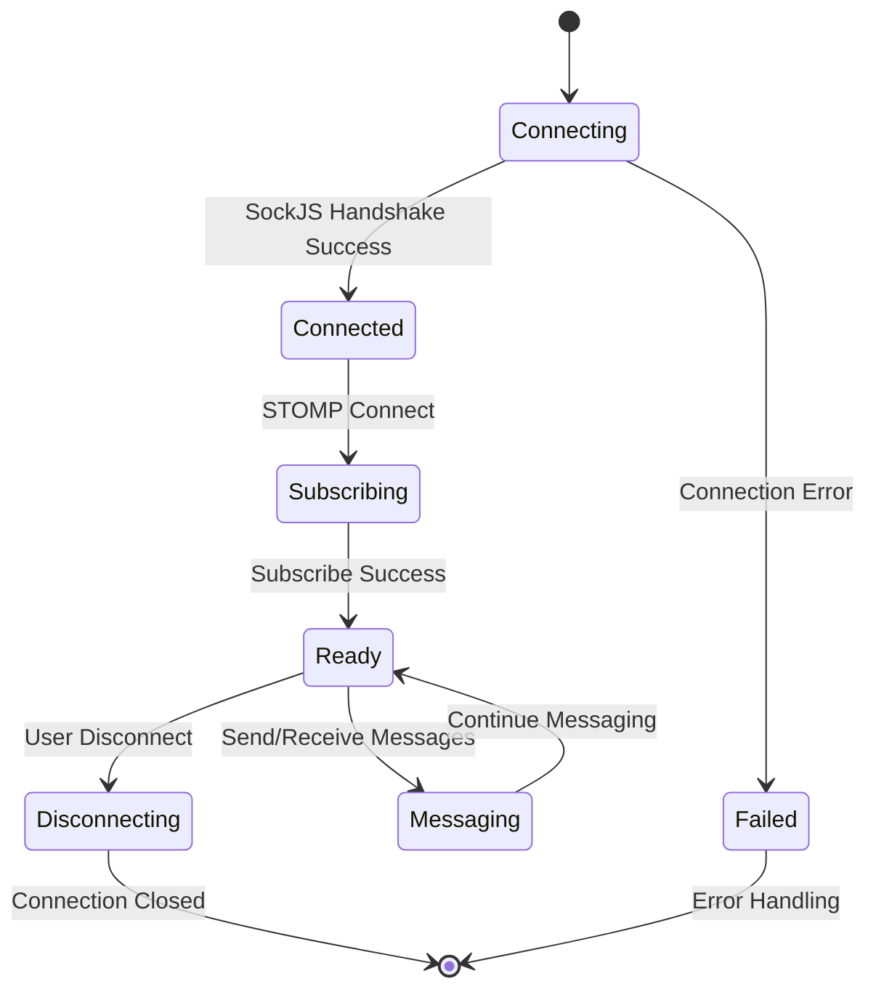
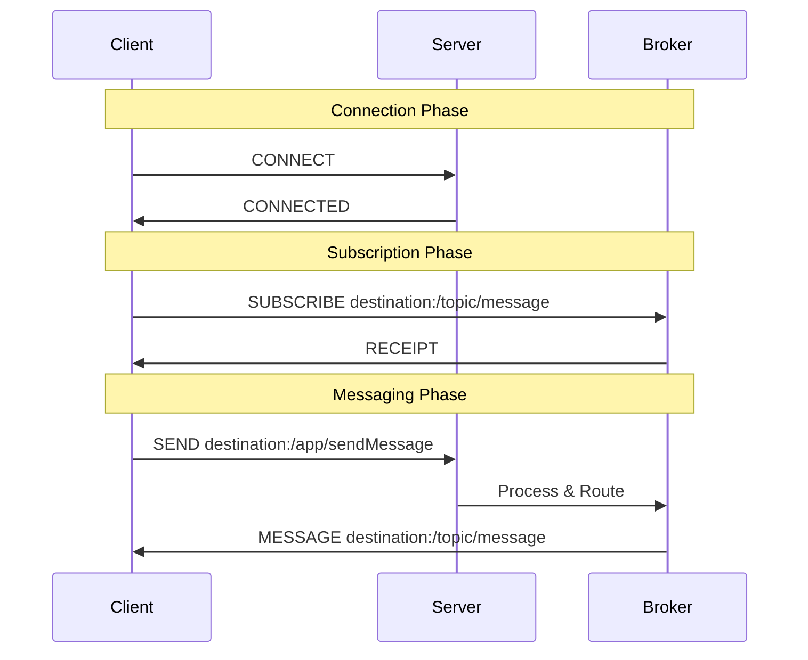
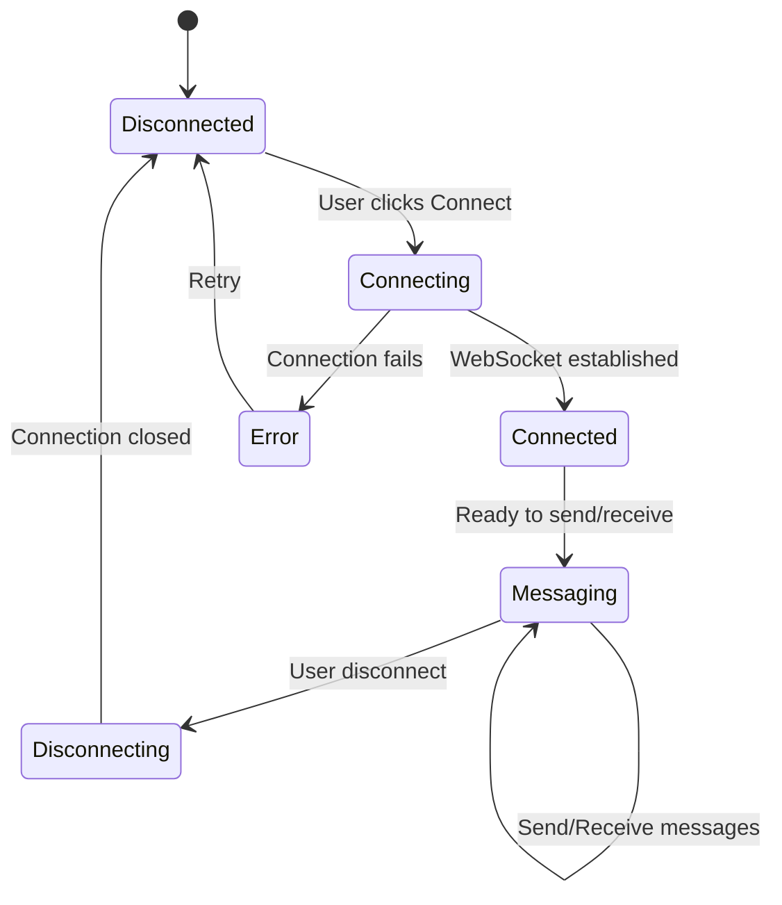
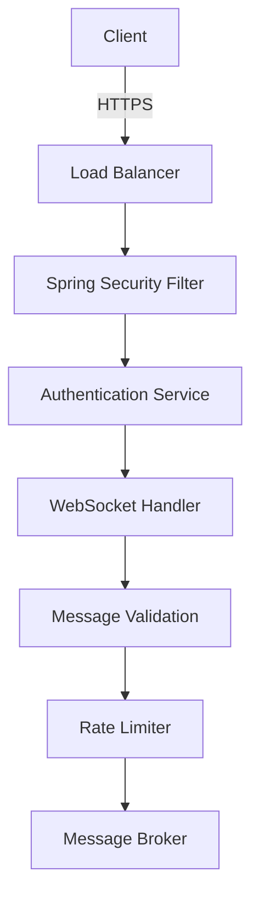
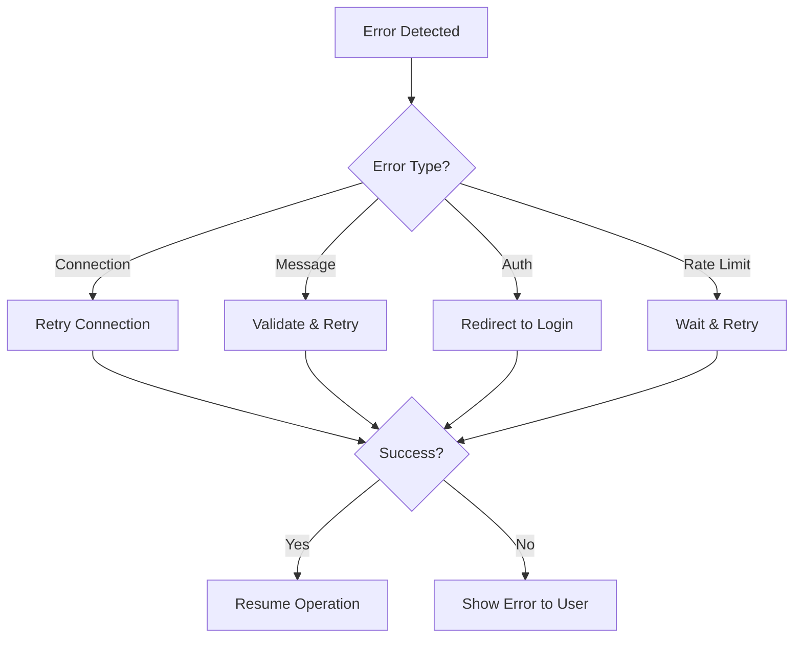

# 🏗️ Technical Architecture Documentation

## **System Architecture Overview**

### **High-Level Architecture**

```
┌─────────────────┐    ┌──────────────────┐    ┌─────────────────┐
│   Web Browser   │    │   Spring Boot    │    │  Message Broker │
│                 │    │     Server       │    │   (In-Memory)   │
│ ┌─────────────┐ │    │ ┌──────────────┐ │    │ ┌─────────────┐ │
│ │  SockJS     │◄┼────┼►│ WebSocket    │ │    │ │SimpleBroker │ │
│ │  Client     │ │    │ │ Handler      │ │    │ │MessageHandle| |
│ │             | |    | |              | |    | |r            | |
│ └─────────────┘ │    │ └──────────────┘ │    │ └─────────────┘ │
│ ┌─────────────┐ │    │ ┌──────────────┐ │    │ ┌─────────────┐ │
│ │ STOMP.js    │◄┼────┼►│ STOMP        │◄┼────┼►│ Topic       │ │
│ │ Client      │ │    │ │ Protocol     │ │    │ │ Routing     │ │
│ └─────────────┘ │    │ └──────────────┘ │    │ └─────────────┘ │
└─────────────────┘    └──────────────────┘    └─────────────────┘
```

## **Component Deep Dive**

### **1. WebSocket Layer**

#### **WebSocketConfig.java**
```java
@Configuration
@EnableWebSocketMessageBroker
public class WebSocketConfig implements WebSocketMessageBrokerConfigurer {
    
    // Configuration Details:
    // - Enables WebSocket message broker
    // - Configures STOMP endpoints
    // - Sets up message routing
}
```

**Key Responsibilities:**
- **Endpoint Registration**: Maps `/chat` to WebSocket handler
- **SockJS Integration**: Provides fallback for non-WebSocket browsers
- **CORS Configuration**: Handles cross-origin requests
- **Message Broker Setup**: Configures destination prefixes

#### **Connection Flow Diagram**


### **2. STOMP Protocol Implementation**

#### **Message Frame Structure**
```
COMMAND
header1:value1
header2:value2

Body Content^@
```

#### **Client-Server Communication**


### **3. Message Routing Architecture**

#### **Destination Mapping**
| Source | Destination | Handler | Purpose |
|--------|-------------|---------|---------|
| Client | `/app/sendMessage` | `ChatController.sendMessage()` | Message Processing |
| Server | `/topic/message` | Message Broker | Broadcast to Subscribers |

#### **Message Flow Pipeline**
```
Client Input → SockJS → STOMP Frame → Spring Controller → Message Broker → All Subscribers
```

### **4. Frontend Architecture**

#### **JavaScript Architecture**
```javascript
// Modular Structure
const ChatApp = {
    connection: {
        stompClient: null,
        connected: false
    },
    
    ui: {
        updateConnectionStatus(),
        displayMessage(),
        handleUserInput()
    },
    
    messaging: {
        connect(),
        disconnect(),
        sendMessage(),
        subscribeToMessages()
    }
};
```

#### **State Management**


### **5. Data Models**

#### **ChatMessage Entity**
```java
public class ChatMessage {
    private Long id;          // Message identifier
    private String message;   // Content payload
    private String sender;    // User identifier
    private String receiver;  // Target user (future use)
    private String timestamp; // Message creation time
}
```

#### **Message JSON Structure**
```json
{
    "id": null,
    "message": "Hello, World!",
    "sender": "john_doe",
    "receiver": null,
    "timestamp": "2025-06-24T14:30:00.000Z"
}
```

## **Performance Analysis**

### **Memory Usage**
```
Component                Memory Usage    Notes
─────────────────────────────────────────────────
WebSocket Connections    ~10KB per      Session management
STOMP Protocol Handler   ~5KB per       Protocol processing
Message Broker          ~1KB per msg    In-memory storage
Total per User          ~15KB + msgs    Scales linearly
```

### **Throughput Metrics**
- **Messages per Second**: ~1000 msg/sec (single server)
- **Concurrent Users**: ~500 users (optimal)
- **Message Latency**: <10ms (local network)
- **Connection Overhead**: ~15KB per user

### **Scalability Bottlenecks**
1. **Memory Limitations**: In-memory broker
2. **Single Server**: No horizontal scaling
3. **Session Management**: All connections on one instance
4. **Message Storage**: No persistence layer

## **Security Architecture**

### **Current Security Model**
```
Layer                Security Measures
─────────────────────────────────────
Transport Layer      HTTP (No HTTPS)
WebSocket Layer      No Authentication
Application Layer    Basic Input Validation
Message Layer        No Encryption
```

### **Security Gaps & Mitigations**
| Vulnerability | Risk Level | Mitigation |
|--------------|------------|------------|
| No Authentication | High | Implement Spring Security |
| No Input Validation | Medium | Add server-side validation |
| No Rate Limiting | Medium | Implement message throttling |
| CORS Wide Open | Low | Restrict allowed origins |

### **Future Security Enhancements**


## **Database Integration (Future)**

### **Proposed Schema**
```sql
-- Users Table
CREATE TABLE users (
    id BIGINT PRIMARY KEY AUTO_INCREMENT,
    username VARCHAR(50) UNIQUE NOT NULL,
    email VARCHAR(100),
    created_at TIMESTAMP DEFAULT CURRENT_TIMESTAMP
);

-- Messages Table
CREATE TABLE messages (
    id BIGINT PRIMARY KEY AUTO_INCREMENT,
    sender_id BIGINT NOT NULL,
    receiver_id BIGINT, -- NULL for broadcast
    message TEXT NOT NULL,
    timestamp TIMESTAMP DEFAULT CURRENT_TIMESTAMP,
    FOREIGN KEY (sender_id) REFERENCES users(id),
    FOREIGN KEY (receiver_id) REFERENCES users(id)
);

-- Chat Rooms Table (Future Enhancement)
CREATE TABLE chat_rooms (
    id BIGINT PRIMARY KEY AUTO_INCREMENT,
    name VARCHAR(100) NOT NULL,
    created_by BIGINT NOT NULL,
    created_at TIMESTAMP DEFAULT CURRENT_TIMESTAMP,
    FOREIGN KEY (created_by) REFERENCES users(id)
);
```

## **Monitoring & Observability**

### **Metrics to Track**
```java
// Custom Metrics
@Component
public class ChatMetrics {
    private final MeterRegistry meterRegistry;
    
    // Connection metrics
    private final Counter activeConnections;
    private final Timer messageLatency;
    private final Gauge memoryUsage;
    
    // Business metrics  
    private final Counter messagesPerMinute;
    private final Counter connectionErrors;
}
```

### **Health Checks**
```java
@Component
public class ChatHealthIndicator implements HealthIndicator {
    @Override
    public Health health() {
        return Health.up()
            .withDetail("activeConnections", getActiveConnections())
            .withDetail("messageQueueSize", getQueueSize())
            .withDetail("brokerStatus", getBrokerStatus())
            .build();
    }
}
```

## **Deployment Architecture**

### **Development Environment**
```
┌─────────────────┐
│   Local Machine │
│                 │
│ ┌─────────────┐ │
│ │ Spring Boot │ │
│ │   :8080     │ │
│ └─────────────┘ │
│                 │
│ ┌─────────────┐ │
│ │   Browser   │ │
│ │ localhost   │ │
│ └─────────────┘ │
└─────────────────┘
```

### **Production Environment (Proposed)**
```
┌─────────────┐    ┌─────────────┐    ┌─────────────┐
│ Load        │    │ App Server  │    │ Message     │
│ Balancer    │    │ (Spring)    │    │ Broker      │
│ (nginx)     │    │             │    │ (Redis)     │
└─────────────┘    └─────────────┘    └─────────────┘
       │                   │                   │
┌─────────────┐    ┌─────────────┐    ┌─────────────┐
│ SSL/TLS     │    │ Session     │    │ Database    │
│ Termination │    │ Store       │    │ (PostgreSQL)│
└─────────────┘    └─────────────┘    └─────────────┘
```

## **Error Handling Strategy**

### **Error Categories**
```java
public enum ChatErrorType {
    CONNECTION_FAILED("WebSocket connection failed"),
    MESSAGE_PARSE_ERROR("Invalid message format"),
    SUBSCRIPTION_ERROR("Failed to subscribe to topic"),
    SEND_MESSAGE_ERROR("Failed to send message"),
    AUTHENTICATION_ERROR("User not authenticated"),
    RATE_LIMIT_ERROR("Message rate exceeded");
}
```

### **Error Recovery Flow**


This technical architecture provides a comprehensive view of the system's design, implementation details, and future enhancement possibilities. The documentation serves as a blueprint for understanding, maintaining, and scaling the chat application. 